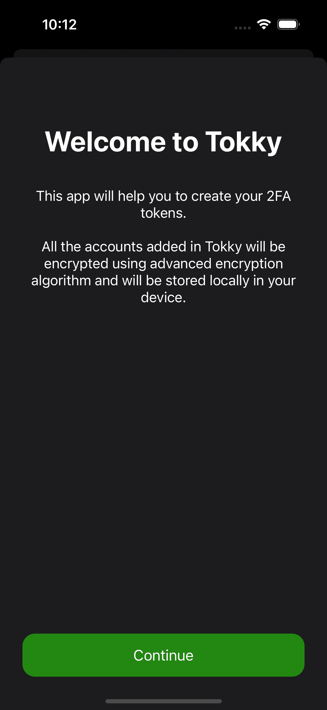
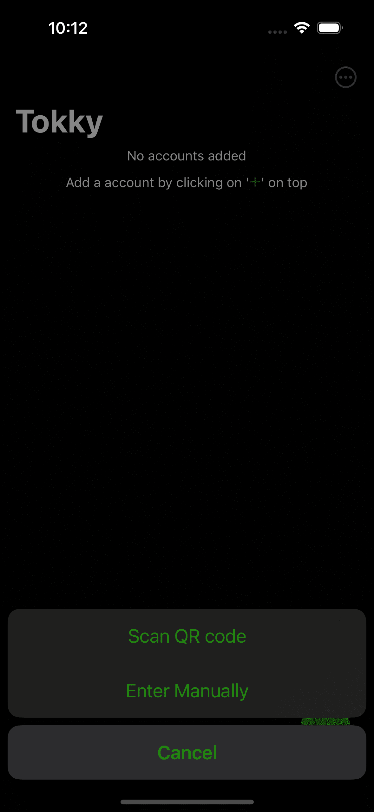
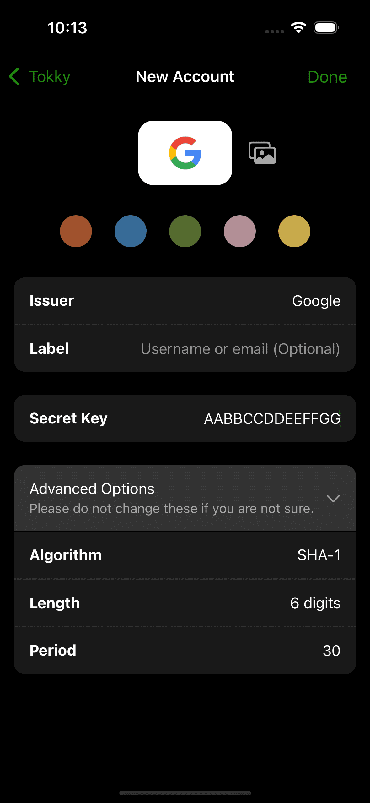
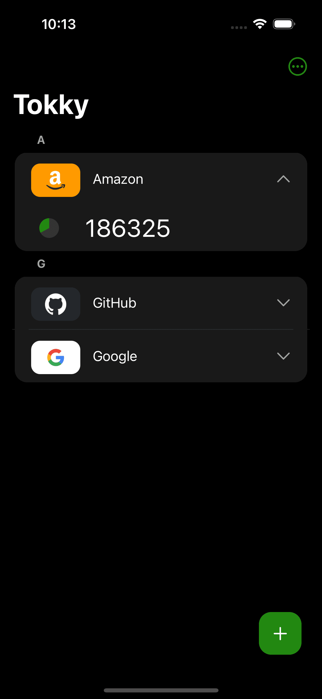
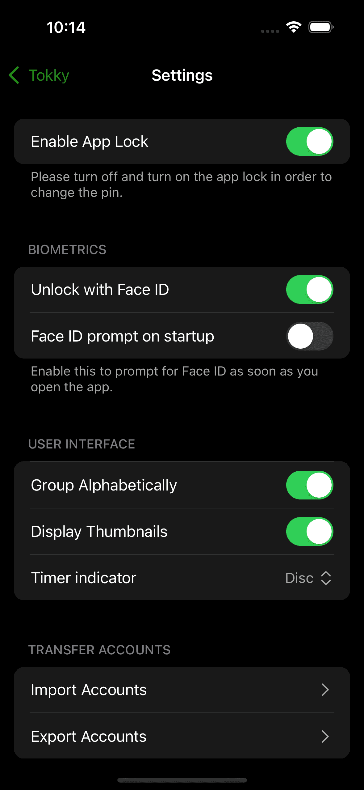
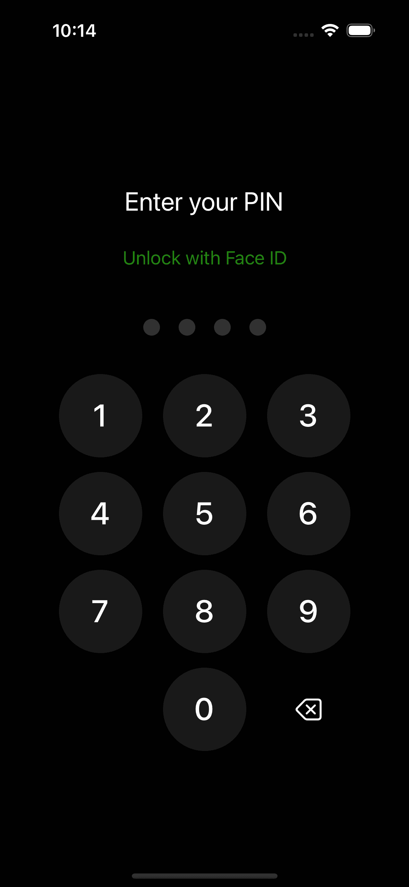

# Tokky - Secure 2FA Application

Tokky is a React Native application designed to provide a robust and secure Two-Factor Authentication (2FA) solution for both Android and iOS platforms. Our primary focus is on user security, ensuring that sensitive authentication keys are stored solely on the user's device, enhancing privacy and minimizing potential vulnerabilities. Tokky offers a seamless and user-friendly experience, prioritizing the safeguarding of your digital identity.

## Key Features
- **Device-Exclusive Key Storage**: Tokky ensures that all authentication keys are stored only on the user's device, adding an extra layer of security.
- **Cross-Platform Compatibility**: Enjoy the convenience of 2FA on both Android and iOS platforms with Tokky's React Native implementation.
- **User-Friendly Interface**: A clean and intuitive interface for a hassle-free 2FA experience.

## Getting Started
Follow the steps below to get started with Tokky on your device:

1. Clone the repository: `git clone https://github.com/pruthvi-21/Tokky-RN.git`
2. Install dependencies: `npm install`
3. Run the application: `npm start`

## Screenshots

    
    
    
    
    
    
    

 

Feel free to explore, contribute, and enhance Tokky's capabilities. Your security is our priority!
